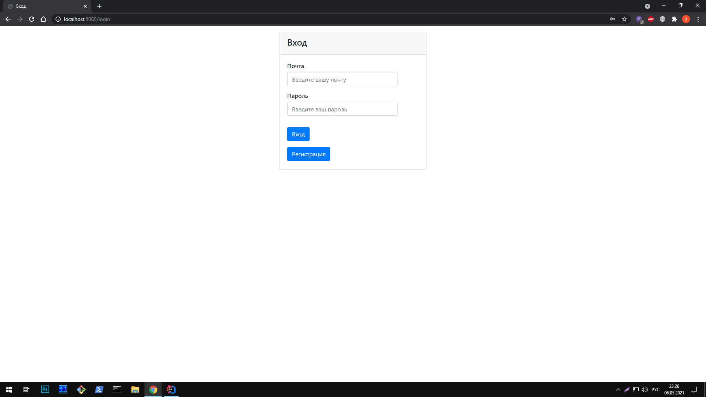
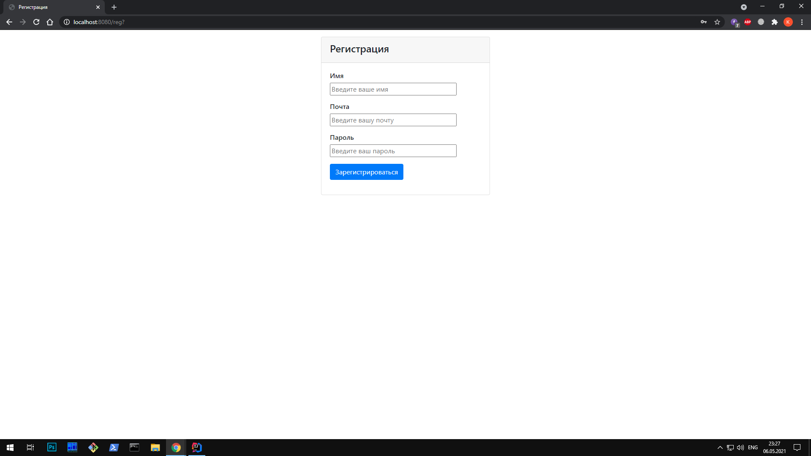
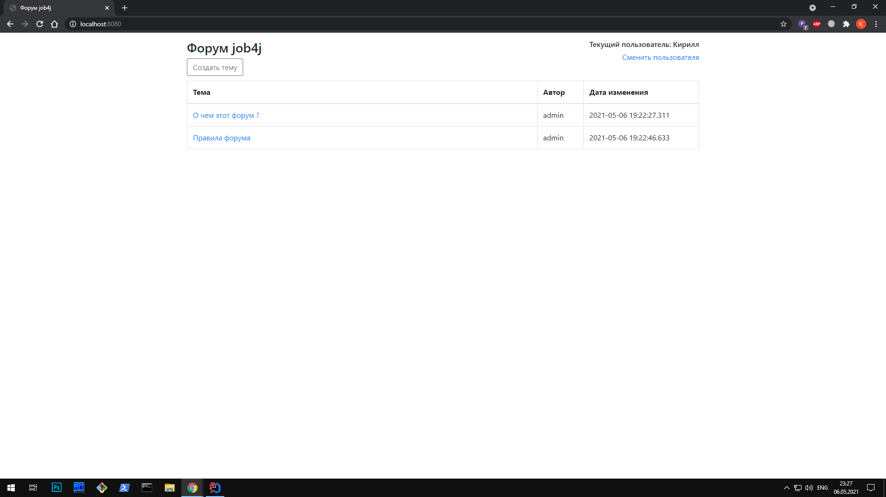
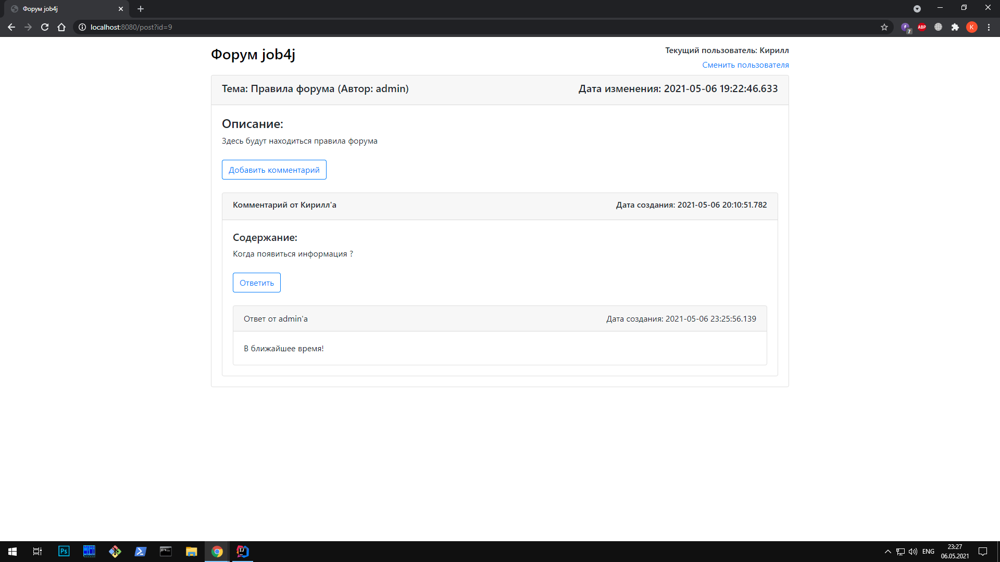
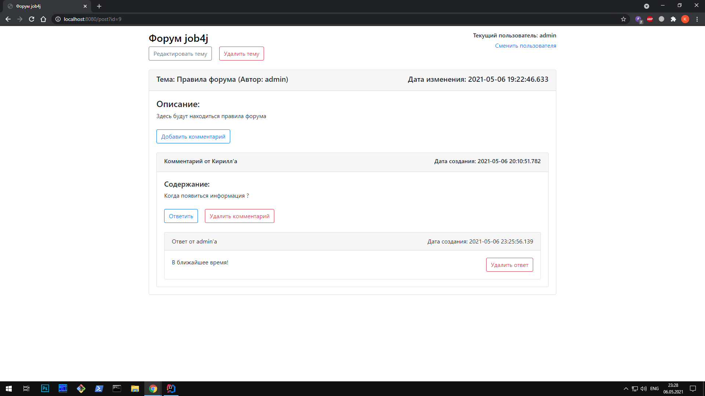
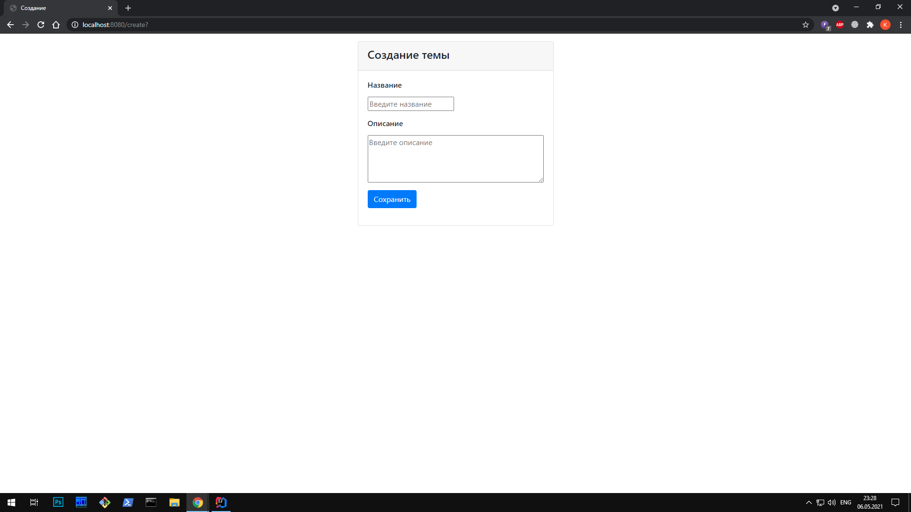
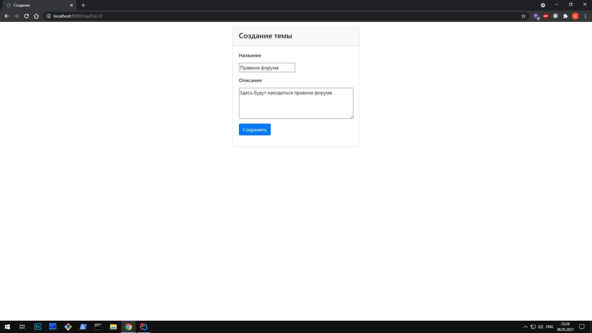

# job4j_forum
## Проект "Форум"
### Веб-приложение форум для общения
## Используемые технологии
* Spring (Boot, Core, MVC, Data, Security)
* Jsp, Html
* Hibernate
* PostgreSQL
* Apache Maven
* Travis CI, CheckStyle
## Функционал приложения
### Для обычного пользователя
* Возможность просмотреть список всех тем
* Возможность добавлять свои темы
* Возможность удалять/редактировать свои темы
* Возможность комментировать любые темы
* Возможность отвечать на любые комментарии
### Для администратора
* Все перечисленные возможности для обычного пользователя
* Возможность удалять и редактировать любые темы
* Возможность удалять комментарии
* Возможность удалять ответы к комментариям
## Интерфейс приложения
### Страница авторизации

### Страница регистрации

### Главная страница после логина

### Страница темы для обычного пользователя

### Страница темы для администратора

### Страница добавления темы

### Страница редактирования темы
